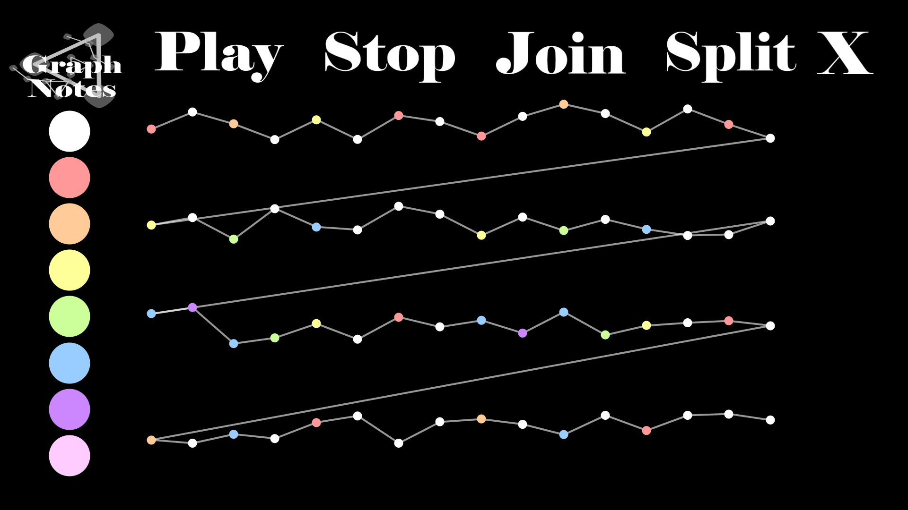

# GraphNotes
A desktop application that relates music to Graphs. It was created using Java in the Processing Development Environment.

The executable file is in the application.windows64 folder

Instructions: To edit a note's pitch, first you must select a color from the left sidebar and then select the node that will be changed.
When you click a node it will play its current note. 

Guide:

-White: Silence

-Red: C

-Orange: D

-Yellow: E

-Green: F

-Blue: G

-Purple: A

-Pink: B

Click "Play" to start playing the song. The nodes will have a small animation to show which one is being played.

Click "Stop" to stop playing the song. It will also rewind it back to the start, so when you press "Play" again, it will play from the beginning.

Click "X" to exit the application.

Note: The application runs in fullscreen. Also, the "split" and "join" buttons are still in development!
